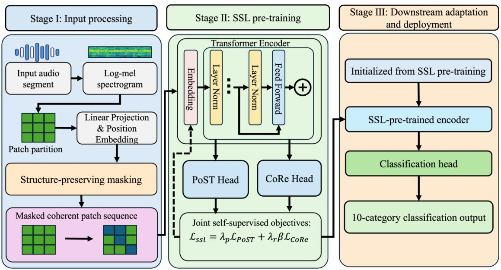
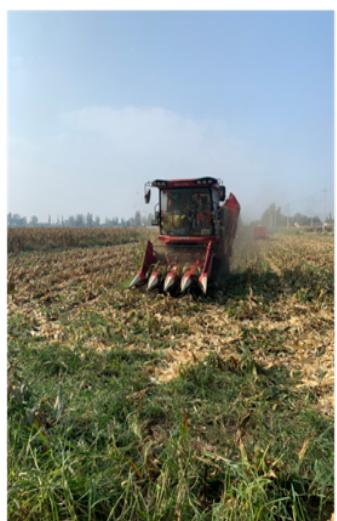
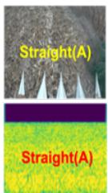
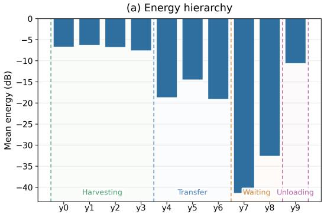
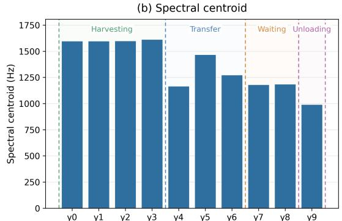
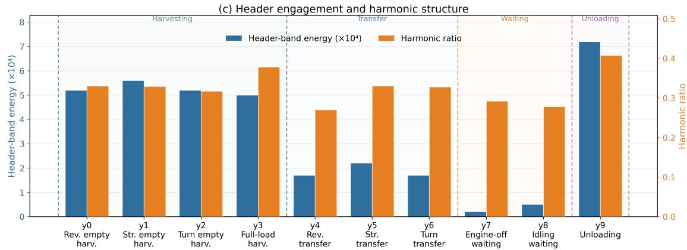
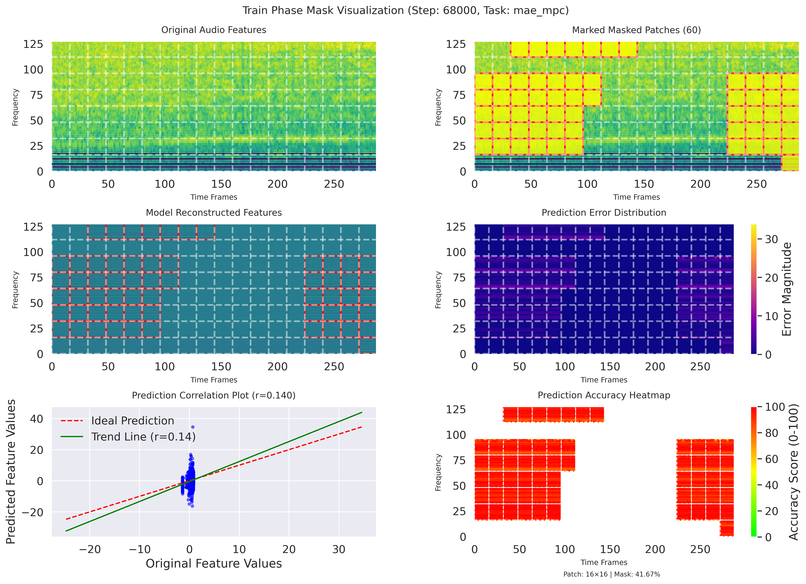
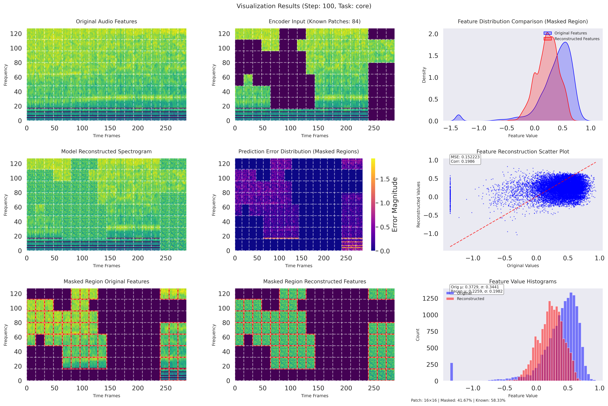

# ComPASS: Self-Supervised Audio Representation Learning for Agricultural Machinery Trajectory Time-Series Classification

**ComPASS** is a task-specific self-supervised audio representation learning framework designed for **agricultural machinery trajectory time-series classification**. It is optimized for agricultural machinery sounds with structured spectro-temporal patterns and naturally imbalanced class distributions.

**Paper**: [A Self-Supervised Audio Learning Model for Agricultural Machinery Trajectory Time-Series Classification](link)

**Code**: [https://github.com/kakushuu/Machinery-Trajectory-Time-Series-Classification](https://github.com/kakushuu/Machinery-Trajectory-Time-Series-Classification)

---

## Overview

This project introduces **synchronized audio signals** into agricultural machinery trajectory time-series classification and proposes ComPASS, a self-supervised framework that learns both **global spectro-temporal organization** and **local acoustic detail** from large-scale unlabeled field recordings.

### Key Contributions

1. **First audio-based trajectory classification**: First introduction of synchronized audio to agricultural machinery trajectory classification
2. **Ten-category classification system**: Detailed operational state recognition beyond binary field-road classification
3. **Task-specific SSL framework**: ComPASS preserves structured machinery acoustics and improves minority-class accuracy

---

## Framework Architecture

### ComPASS Overview

<p align="center">
  
</p>

**ComPASS** consists of three stages:
- **Stage I**: Input processing (log-mel spectrogram → patch embedding → structure-preserving masking)
- **Stage II**: Self-supervised pre-training with PoST and CoRe
- **Stage III**: Fine-tuning for 10-category downstream classification

---

## Dataset

### Data Collection

<p align="center">
  
</p>

The full audio corpus contains:
- **85,432** audio segments (3 seconds each, 16 kHz sampling rate)
- Collected from combine harvesters in **Ningxia, Shaanxi, and Inner Mongolia**
- Recorded during the **2023–2024 harvesting seasons**

### Data Splits
- **78,913** unlabeled segments for self-supervised pre-training
- **6,519** labeled segments for downstream evaluation
  - Training: 3,257 samples
  - Validation: 1,087 samples
  - Test: 2,175 samples

The labeled split is **machine-disjoint** (no harvester identity overlaps across splits).

### Ten-Category Classification System

| Label | Category | Description |
|:---:|:---|:---|
| y0 | Reverse empty harvesting | Harvesting mode without crop intake, moving backward |
| y1 | Straight empty harvesting | Harvesting mode without crop intake, straight line |
| y2 | Turning empty harvesting | Harvesting mode without crop intake, turning movement |
| y3 | Full-load harvesting | Normal harvesting with active crop intake |
| y4 | Reverse transfer | Not harvesting, moving backward during transfer |
| y5 | Straight transfer | Not harvesting, straight-line transfer |
| y6 | Turning transfer | Not harvesting, turning movement during transfer |
| y7 | Engine-off waiting | Stationary with engine off |
| y8 | Idling waiting | Stationary with engine idling |
| y9 | Unloading | Stationary while unloading harvested crop |

These categories were established from **real harvesting workflows** and **video-assisted annotation** of synchronized field recordings.

---

## Acoustic Characteristics

### Mel-Spectrogram Examples

<p align="center">
  
</p>

### Quantitative Acoustic Analysis

<p align="center">
  
  
  
</p>

**Key observations**:
- **Harvesting-related categories** (y0-y3): Highest energy, richest spectral structure
- **Transfer-related categories** (y4-y6): Lower energy, weaker harvesting components
- **Waiting categories** (y7-y8): Clearly separated by engine condition
- **Unloading** (y9): Distinct low-centroid, highly periodic profile due to auger operation

These acoustic differences support using synchronized audio to complement trajectory-based classification.

---

## Method

### Stage I: Input Processing

1. **Log-mel spectrogram generation**: Convert 3s audio → 128×300 spectrogram
2. **Patch embedding**: Divide into 16×16 non-overlapping patches (144 patches total)
3. **Structure-Preserving Masking Strategy (SPMS)**:
   - Apply K-means clustering (K=16) on patch embeddings
   - Mask entire clusters to preserve acoustic coherence
   - Result: Visible regions remain structurally organized

### Stage II: Self-Supervised Pre-training

#### PoST: Position-aware Masked Prediction

**Objective**: Learn global spectro-temporal organization

<p align="center">
  
</p>

**Mechanism**:
1. Replace masked patches with learnable `mask_embed` token
2. Feed through Transformer encoder → H (hidden states)
3. Extract H_M (hidden states at masked positions)
4. Predict original absolute positions via cross-entropy loss:

```
P^(p) = Softmax(H_M · W_p + b_p)
L_PoST = −Σ log P^(p)(y_p)
```

**Visualization**: Shows discriminative mask prediction results at different training steps. Brighter regions indicate higher position prediction confidence.

#### CoRe: Context-driven Spectrogram Reconstruction

**Objective**: Learn local acoustic detail

<p align="center">
  
</p>

**Mechanism**:
1. Same masking as PoST (shared mask indices)
2. Same Transformer forward pass with mask tokens
3. Extract H_M from masked positions
4. Reconstruct original spectrogram content via MSE loss:

```
X̂_M = H_M · W_r + b_r
L_CoRe = (1/M)‖X̂_M − X_M‖²_F
```

**Visualization**: Shows generative reconstruction results. The model learns to fill in masked spectrogram regions with acoustically plausible content.

#### Joint Training

Combined loss with balanced weighting:

```
L_ssl = L_PoST + L_CoRe
```

This dual-objective formulation ensures the encoder learns both:
- **Global structural relationships** (via PoST position prediction)
- **Local acoustic details** (via CoRe content reconstruction)

---

## Experimental Results

### Model Ablation Study

| Method | Val Accuracy | Best Epoch | Description |
|:---|:---:|:---:|:---|
| MAE+MPC | 71.99% | 68 | Joint discriminative + generative |
| NoKD-MPC | 71.49% | 63 | MPC without knowledge distillation |
| Similarity-Aware PoST | 69.55% | 35 | PoST with similarity-aware clustering |
| PoST-only | 53.23% | 74 | Position prediction only |
| CoRe-only | *see logs* | - | Reconstruction only |
| **ComPASS (Final)** | **89.2%** | - | **PoST + CoRe joint training** |

### Final ComPASS Performance

**Test Set Results**:
- **Accuracy**: **89.2%**
- **mAP**: **74.1%**

ComPASS outperforms all supervised and self-supervised baselines, with particular improvements on minority categories under naturally imbalanced conditions.

---

## Repository Structure

```text
.
├── data/                     # Dataset metadata and class labels
│   └── machinery_class_labels_indices.csv
├── configs/                  # Training and evaluation configs
│   └── experiment_params.json
├── models/                   # Model definitions
│   ├── __init__.py
│   └── model.py             # CompassModel (PoST + CoRe + SPMS)
├── preprocessing/            # Audio preprocessing and dataloader
│   └── dataloader.py
├── training/                 # Training scripts and utilities
│   ├── run.py               # Main training entry point
│   ├── traintest.py         # Fine-tuning training loop
│   ├── traintest_mask.py    # Pre-training with masking
│   ├── utilities/           # Core utilities (stats, AverageMeter)
│   ├── utils/               # Visualization tools (SSASTVisualizer)
│   ├── run_pretrain.sh      # Pre-training launch script
│   └── run_finetune.sh      # Fine-tuning launch script
├── evaluation/               # Experiment results and configs
│   ├── results/             # Performance metrics and ablation summaries
│   │   └── ablation_results_summary.json
│   └── configs/             # Saved experiment configurations
├── figures/                  # Visualizations for paper
│   ├── compass_framework.jpg           # ComPASS architecture overview
│   ├── data_collection_setup.jpg       # Data collection setup
│   ├── mel_spectrogram_*.jpg           # 10-category spectrogram examples
│   ├── acoustic_characteristics_*.jpg  # Acoustic analysis plots
│   ├── model_ablation/                 # PoST and CoRe training visualizations
│   │   ├── post_sample_*.png          # PoST position prediction results
│   │   └── core_sample_*.png          # CoRe reconstruction results
│   └── architecture/                   # Model architecture diagrams
├── checkpoints/              # Saved model checkpoints
└── README.md
```

---

## Key Components

### Models (`models/`)
**`CompassModel`**: Main model class implementing:
- **SPMS (Structure-Preserving Masking Strategy)**: K-means clustering with K=16
- **PoST (Position-aware masked prediction)**: Discriminative pretext task
- **CoRe (Context-driven spectrogram reconstruction)**: Generative pretext task
- **Joint training**: L_ssl = L_PoST + L_CoRe

**Architecture**:
- Backbone: DeiT-base (12 layers, 768-dim embeddings, 12 heads)
- Patch size: 16×16 (144 patches per spectrogram)
- Input: 128-bin log-mel, target_length=300

### Training (`training/`)
- **`run.py`**: Main entry point supporting multiple pre-training tasks
- **`traintest_mask.py`**: Pre-training with SPMS masking and visualization
- **`traintest.py`**: Downstream fine-tuning on labeled data
- **`utilities/`**: Core metrics (mAP, AUC, accuracy) and logging utilities
- **`utils/visualization.py`**: SSASTVisualizer for generating paper figures

### Evaluation (`evaluation/`)
- **`results/`**: Ablation study results, best model metrics, performance summaries
- **`configs/`**: Saved experiment configurations for reproducibility

### Figures (`figures/`)
- **Framework overview** (`compass_framework.jpg`): Complete ComPASS architecture
- **Acoustic analysis** (`acoustic_characteristics_*.jpg`): Energy, centroid, harmonic ratio
- **Model ablation** (`model_ablation/`): Training intermediate results from PoST and CoRe
- **Architecture diagrams** (`architecture/`): Model architecture visualizations

---

## Usage

### Pre-training

```bash
cd training
bash run_pretrain.sh
```

**Configuration**:
- **Task**: `pretrain_compass` (joint PoST + CoRe training)
- **Mask patches**: 60 (out of 144 total patches, ~41.7% mask ratio)
- **SPMS**: K-means K=16 for structure-preserving masking
- **Batch size**: 24
- **Learning rate**: 1e-4
- **Epochs**: 100

### Fine-tuning

```bash
cd training
bash run_finetune.sh
```

Fine-tuning uses the pre-trained encoder with a classification head for the 10-category downstream task.

**Configuration**:
- **Task**: `ft_cls` or `ft_avgtok`
- **Batch size**: 24
- **Learning rate**: 5e-5
- **Epochs**: 30

---

## Dependencies

See `requirements.txt` for complete dependencies. Key packages:

```
torch >= 2.0
timm >= 0.9.0
scikit-learn >= 1.3.0
librosa >= 0.10.0
numpy >= 1.24.0
scipy >= 1.11.0
matplotlib >= 3.7.0
seaborn >= 0.12.0
```

---

## Citation

If you use this code in your research, please cite:

```bibtex
@article{compass2025,
  title={A Self-Supervised Audio Learning Model for Agricultural Machinery Trajectory Time-Series Classification},
  author={Guo, Zhou and Pan, Jiawen and Zhai, Weixin},
  journal={},
  year={2025}
}
```

---

## License

This project is licensed under the MIT License - see the LICENSE file for details.

---

## Acknowledgments

This work was supported by the College of Information and Electrical Engineering, China Agricultural University.

---

## Contact

For questions and feedback, please open an issue on GitHub or contact the authors.
